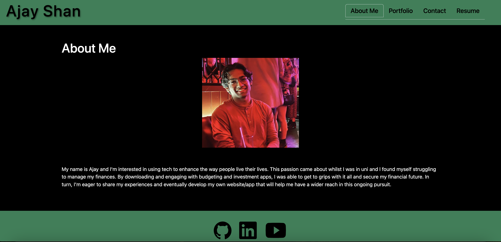

# Ajay's React Portfolio 💼

## Description
The purpose of this project is to use React to create a single-page professional web development portfolio to showcase my skills, talents and projects I've worked on.

## Requirements
- Ensure presented with a header, section for content and footer when single-page application portfolio is loaded
- Ensure viewing header presents developer's name and navigation with titles corresponding to different sections of the portfolio
- Ensure viewing navigation titles presents titles About, Portfolio, Contact and Resume with current section title highlighted
- Ensure clicking on navigation title changes browser URL and presents corresponding section below and title is highlighted in navigation bar
- Ensure loading portfolio for first time presents About section by default
- Ensure About section shows recent photo of developer and short bio
- Ensure Portfolio section shows 6 developer applications with links to deployed sites and corresponding GitHub repositories
- Ensure Contact section shows contact form with fields for name, email and message
- Ensure attempting to submit without entering text leads to a notification
- Ensure email is valid when entering text in email address field
- Ensure Resume section shows a downloadable CV and list of developer's skills/proficiencies
- Ensure viewing footer presents icon links to developer's GitHub, LinkedIn and profile on 3rd platform

## Web Application Preview

## Submission Requirements
- [Deployed Application](https://ajay-react-portfolio.onrender.com/)
- [GitHub Repo](https://github.com/ajayshans/ajay-react-portfolio)